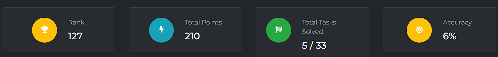
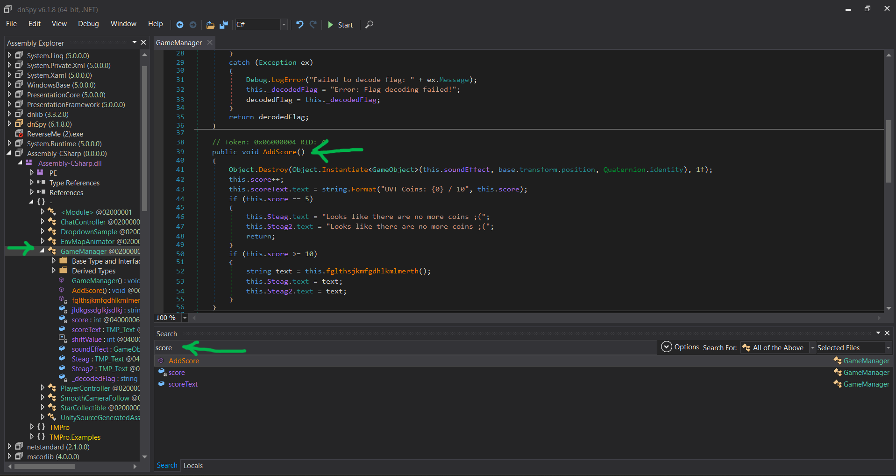
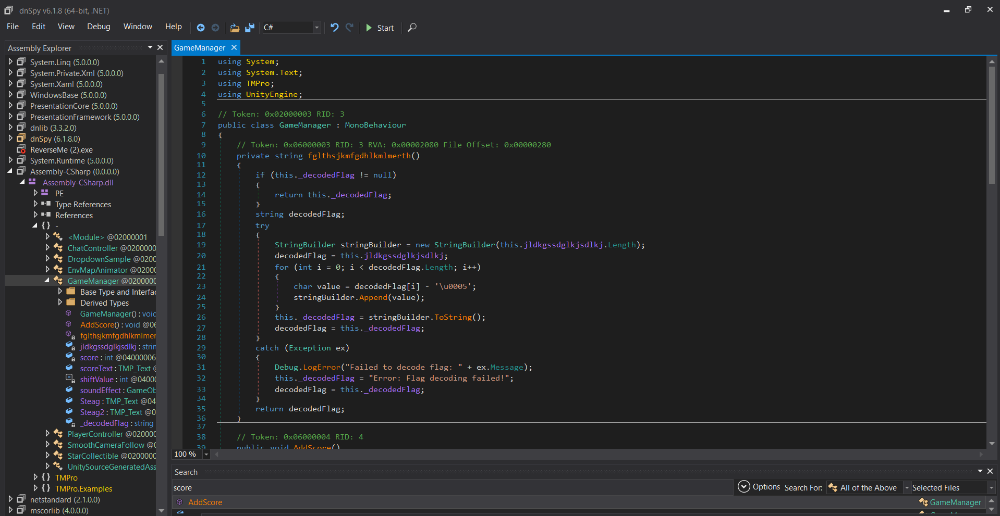

# UniVsThreats CTF 2025
# Write up
#### José David Jayk Vanegas
#### Username: josedjaykv

## Resumen (03-05-2025 20:56)

## Insert Coin to Play – Part 1
### Categoría: 
`Reversing`
### Herramientas usadas: 
`dnSpy`

Al descomprimir el archivo que nos daban y ejecutar el juego me di cuenta que en la logica del juego la partida terminaba cuando encontrabamos las 5 monedas y no pasaba nada.

Al navegar por los archivos encontré uno llamado `Assembly-CSharp.dll` en la ruta `Insert coin to play - Part 1\GTA5_Data\Managed\Assembly-CSharp.dll`. Este archivo lo abrí en `dnSpy`.

En `dnSpy` busqué la palabra `score` ya que por la logica del juego y por la descripción que nos daban supuse que tenía que ver algo con el `score` que obeníamos. Al buscar encontré lo siguiente

Aquí pude ver la lógica del juego y me di cuenta que para que se ejecutar la función `fglthsjkmfgdhlkmlmerth()` debía obtener 10 puntos, pero esto no es posible porque en el mapa solo nos aparecen 5 monedas. Entonces lo que hice fue construir esa función en `fglthsjkmfgdhlkmlmerth()` `java` y ejecutarla para decodificar y retornar la  `Flag `.

Función `fglthsjkmfgdhlkmlmerth()`:

Función `fglthsjkmfgdhlkmlmerth()` modificada para solo extraer la flag decodificada:
<pre> 
public class FlagDecoder {

    // La cadena codificada
    private String encodedFlag = "Z[Y`Q55pxdq6P8dYm8w8d|8W8dR5w8dh56S:b";

    // Decodificar la flag
    public String decodeFlag() {
        StringBuilder decodedFlag = new StringBuilder(encodedFlag.length());
        
        // Recorrer cada caracter de la cadena codificada y restarle 5
        for (int i = 0; i < encodedFlag.length(); i++) {
            // Convertir el resultado de la resta a char
            char value = (char) (encodedFlag.charAt(i) - 5);
            decodedFlag.append(value);
        }
        
        // Retornar la flag decodificada
        return decodedFlag.toString();
    }

    public static void main(String[] args) {
        FlagDecoder decoder = new FlagDecoder();
        String flag = decoder.decodeFlag();
        System.out.println("Decoded Flag: " + flag);  // Imprime la flag decodificada
    }
}  
</pre>

Output --> `Decoded Flag: UVT{L00ks_l1K3_Th3r3_w3R3_M0r3_c01N5}`
