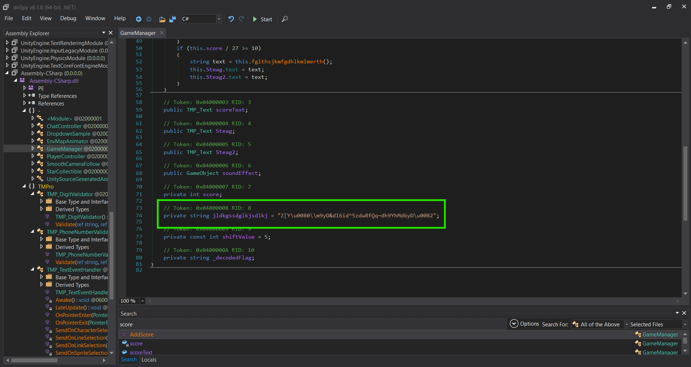
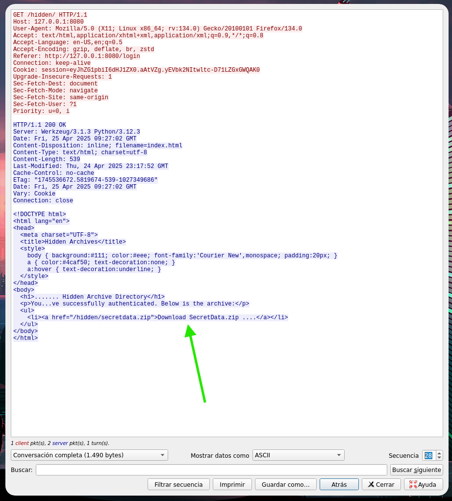
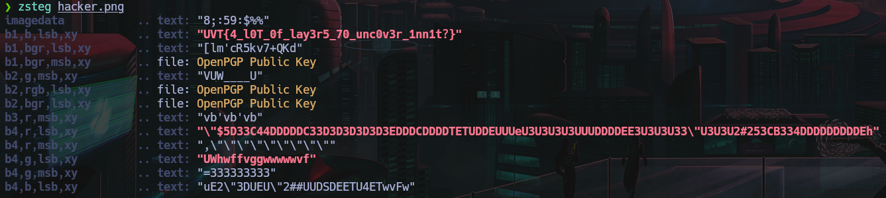

# UniVsThreats CTF 2025
# Write up
#### José David Jayk Vanegas
#### Username: josedjaykv

## Resumen (03-05-2025 20:56)

## Insert Coin to Play – Part 1
### Categoría: 
`Reversing`
### Herramientas usadas: 
`dnSpy`

Al descomprimir el archivo que nos daban y ejecutar el juego me di cuenta que en la logica del juego la partida terminaba cuando encontrabamos las 5 monedas y no pasaba nada.

Al navegar por los archivos encontré uno llamado `Assembly-CSharp.dll` en la ruta `Insert coin to play - Part 1\GTA5_Data\Managed\Assembly-CSharp.dll`. Este archivo lo abrí en `dnSpy`.

En `dnSpy` busqué la palabra `score` ya que por la logica del juego y por la descripción que nos daban supuse que tenía que ver algo con el `score` que obeníamos. Al buscar encontré lo siguiente

Aquí pude ver la lógica del juego y me di cuenta que para que se ejecutar la función `fglthsjkmfgdhlkmlmerth()` debía obtener 10 puntos, pero esto no es posible porque en el mapa solo nos aparecen 5 monedas. Entonces lo que hice fue construir esa función en `fglthsjkmfgdhlkmlmerth()` `java` y ejecutarla para decodificar y retornar la  `Flag `.

Función `fglthsjkmfgdhlkmlmerth()`:

Función `fglthsjkmfgdhlkmlmerth()` modificada para solo extraer la flag decodificada:
<pre> 
public class FlagDecoder {

    // La cadena codificada
    private String encodedFlag = "Z[Y`Q55pxdq6P8dYm8w8d|8W8dR5w8dh56S:b";

    // Decodificar la flag
    public String decodeFlag() {
        StringBuilder decodedFlag = new StringBuilder(encodedFlag.length());
        
        // Recorrer cada caracter de la cadena codificada y restarle 5
        for (int i = 0; i < encodedFlag.length(); i++) {
            // Convertir el resultado de la resta a char
            char value = (char) (encodedFlag.charAt(i) - 5);
            decodedFlag.append(value);
        }
        
        // Retornar la flag decodificada
        return decodedFlag.toString();
    }

    public static void main(String[] args) {
        FlagDecoder decoder = new FlagDecoder();
        String flag = decoder.decodeFlag();
        System.out.println("Decoded Flag: " + flag);  // Imprime la flag decodificada
    }
}  
</pre>

Lo que se le pasaba a la fucnión `fglthsjkmfgdhlkmlmerth()` estaba más abajo en la clase. En el proximo reto que es similar voy a mostrar donde se encontraba.

Output --> `Decoded Flag: UVT{L00ks_l1K3_Th3r3_w3R3_M0r3_c01N5}`

## Insert Coin to Play – Part 2
### Categoría: 
`Reversing`
### Herramientas usadas: 
`dnSpy`

Al ejecutar el juego de este reto vi que también tenía una dinámica que imposibilitaba obtener las 10 monetas. Entonces busqué directamente a la función `AddScore` y vi que era similar, también llamba a la función `fglthsjkmfgdhlkmlmerth()`. Como vi que era tan parecido hice lo mismo con la anterior.

Para decodificar la `flag` utilicé el mismo código `java` mostrado en el ejercicio anterior pero simplemente cambié lo que recibía la función `fglthsjkmfgdhlkmlmerth()`.

Output: --> `Decoded Flag: UVT{Wh4t?!_D1d_Y0u_r3aLly_c4TcH_1t?}`

## Dark Web Stories

### Categoría: 
`Forense` `esteganografia`
### Herramientas usadas: 
`Wireshark``

En este reto teníamos que analizar un archivo `.pcap`. Siguiendo la secuencia `TCP` pude ver que lo que estaba pasando era que alguien estaba intentando accedes a un dominio `.onion` con credenciales comunes e incluso con algunas inyecciones. Luego pudee ver que pudieron entrar con estas credenciales `username=admin&password=%27+or+1%3D1--+-` ya que se recibía el `200 OK` y mostraba los siguiente que me parecía sospechoso.

Seguí avanzando en la secuencia del protocolo `TCP` y encontré una una conversación entre el usuario `R1kS` y `Charon VI`:

- R1kS: Yo, are you here? Got something for you.
- Charon VI: Hey, what's up?
- R1kS: Was crawling on their website, 68b36d42880c527fb70086b1b97f4f34e49bc0d538f52607ec4009c552c2a63b.onion, or BlackVault as they call it. Managed to retrieve their sensitive documents, but somehow it's password protected and i cannot crack it using my regular tools.
- Charon VI: Great job. Thought since the begining that they encrypt their files in case of a breakout.
- Charon VI: Luckily, more or less, they were holding some of their passowrds in a database located on another server. Glad I was able to find it.
- R1kS: That's very good. So, will you give me the password for this secret archive?
- Charon VI: I will, but something is not right. There are multiple strings, and I don't understand what to do with them. Maybe you can find out.
- R1kS: Sure. Drop 'em here. Those guys will finally learn Dark Web is not for everyone. They will not even know what struck them.
- Charon VI: I will drop 'em one by one.
- Charon VI: 5dbc98dcc983a70728bd082d1a47546e
- Charon VI: f72c915d8f575a5c0999b5f37b6d99b7
- ... y envía 18 más

Con esto supuse que era la clave para algún archivo, y lo relacioné con el archivo `SecretData.zip` (que se ve en la imagen anterior) que pudo haber descargado la persona que previamente habíamos visto que pudo entrar credenciales falsas.

Entonces ejecuté este comando `tshark -r conversation_dump.pcap --export-objects http,exported_files/` para guardar en una carpeta todos los objetos `HTTP` descargandos esperando que ahí estuviera el `SecretData.zip`. Efectivamente si estaba pero pedía una contraseña, pero para eso usé las claves que el usuario `Charon VI` le proporcionó a `RikS`. 

Estas "claves" eran unos `hashes`, intenté ponerlos uno por uno y no me daban, los puse juntos y tampoco, entonces lo que hice fue ver que `string` me generaban y vi que me iban dando parte de un string, entonces hice este pequeño código en python para ver que me podrían dar.

<pre>
    import hashlib
import string

hashes = [
    "5dbc98dcc983a70728bd082d1a47546e",
    "f72c915d8f575a5c0999b5f37b6d99b7",
    "a20bba554bfa1580a9d4aa2b6879ed46",
    "02beeea47ee3cfe212e6bd843b9ce7d3",
    "3112c7a8b6cd1677db0e3173e140fc05",
    "50f4646135205fd4a5417e460cf71d3c",
    "eb22cfa0890a2df3177966854a7176bc",
    "845f49aa19c955b849d57593bf09d224",
    "87f63931da79aa969ac4a776ce6cfb03",
    "9793d9d6041c80f46ad7c1f530c8bbf8",
    "2f88d89a8f50426a6285449be3286708",
    "61bd22f017588208a0cacdf9a1a7ca1e",
    "a7623c8b76316e10538782371b709415",
    "c6cca42180caba17e9e6882dc66cc6ee",
    "7c854900e46ebc5ee5680032b3e334de",
    "ac81882b848b7673d73777ca22908c0d",
    "4ce97d67963edca55cdd21d46a68f5bb",
    "4abb62a00bccb775321f2720f2c7750b",
    "67e00e8ef738fe75afdb42b22e50371e",
    "b561052e5697ee5f1491b5e350fb78e1",
]

charset = string.ascii_letters + string.digits + string.punctuation
current = ""

for target_hash in hashes:
    found = False
    for char in charset:
        attempt = current + char
        if hashlib.md5(attempt.encode()).hexdigest() == target_hash:
            current = attempt
            print(f"[+] Found: {current}")
            found = True
            break
    if not found:
        print(f"[-] Could not find match for hash: {target_hash}")
        break

print("\nPossible final password:", current)
</pre>

Output
<pre>
   [+] Found: S
[+] Found: Su
[+] Found: Sup
[+] Found: Sup3
[+] Found: Sup3r
[+] Found: Sup3r$
[+] Found: Sup3r$3
[+] Found: Sup3r$3c
[+] Found: Sup3r$3cr
[+] Found: Sup3r$3cre
[+] Found: Sup3r$3cre7
[+] Found: Sup3r$3cre7P
[+] Found: Sup3r$3cre7P4
[+] Found: Sup3r$3cre7P4$
[+] Found: Sup3r$3cre7P4$S
[+] Found: Sup3r$3cre7P4$Sw
[+] Found: Sup3r$3cre7P4$Sw0
[+] Found: Sup3r$3cre7P4$Sw0r
[+] Found: Sup3r$3cre7P4$Sw0rd
[+] Found: Sup3r$3cre7P4$Sw0rd!

Possible final password: Sup3r$3cre7P4$Sw0rd! 
</pre>

Con esa contraseña pude descomprimir el arlchivo .zip, pero adentro había una imagen `.png`. Esta imagen la analicé con `zsteg` y enconté la flag.

## Shuffling

### Categoría: 
`Criptografía`

En este reto nos daban esta conexión `nc 91.99.1.179 60000` que nos daba un hexadecimal y nos daban el archivo `source.py`. Lo que hice fue hacer un archivo de python donde se hciera el proceso inverso en un delta de tiempo de 1 hora para poder encontrar la semilla del aleatorio.

Mi código de python
<pre>
    import time
import random
from datetime import datetime

target_hex = "59a9217ebd972fe26c45881354abb3b26d20e2acc58a2fd89b99a8295737f093"
target_ct = bytes.fromhex(target_hex)

P = [15, 6, 19, 20, 28, 11, 27, 16, 0, 14, 22, 25,
     4, 17, 30, 9, 1, 7, 23, 13, 31, 26, 2, 8, 18,
     12, 29, 5, 21, 10, 3, 24]

def unshuffle(l):
    unshuffled = [0] * 32
    for i, p in enumerate(P):
        unshuffled[p] = l[i]
    return unshuffled

def decrypt_ct():
    now = int(time.time())
    print("[*] Probando timestamps desde ahora hasta hace 1 hora...")

    for delta in range(3600):  # hasta 1 hora hacia atrás
        ts = now - delta
        random.seed(ts)
        padded = [random.randint(32, 125) for _ in range(32)]
        shuffled = [padded[p] for p in P]

        random.seed(sum(shuffled))
        key = random.randbytes(32)

        decrypted = [x ^ y for x, y in zip(target_ct, key)]
        unshuffled = unshuffle(decrypted)

        try:
            text = "".join(chr(c) for c in unshuffled)
            if text.startswith("UVT{"):
                print(f"[+] Posible flag encontrada:")
                print(f"    Timestamp: {ts} -> {datetime.fromtimestamp(ts)}")
                print(f"    Flag?: {text}")
                return
        except:
            continue

    print("[-] No se encontró ninguna flag que empiece por UVT{ en 1h.")

decrypt_ct()
</pre>

Output
<pre>
    [*] Probando timestamps desde ahora hasta hace 1 hora...
    [+] Posible flag encontrada:
    Timestamp: 1746285233 -> 2025-05-03 10:13:53
    Flag?: UVT{1_l1ke_t0_m0v3_1t_m0v3_i7}s3
</pre>
